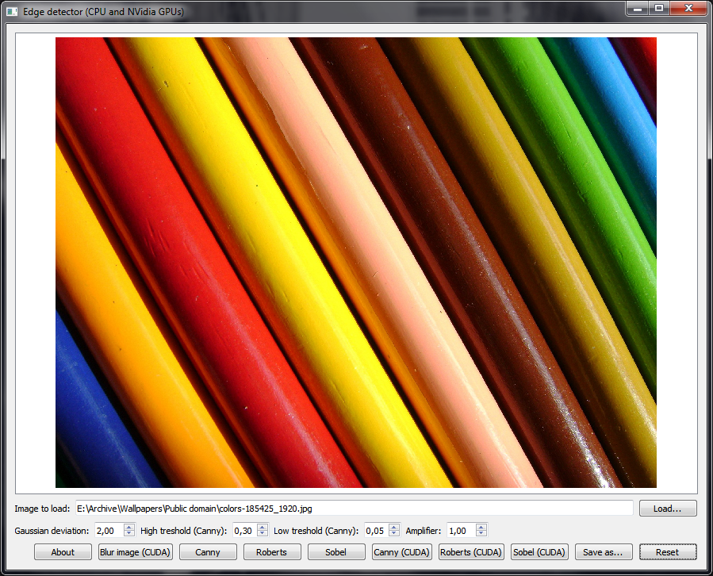
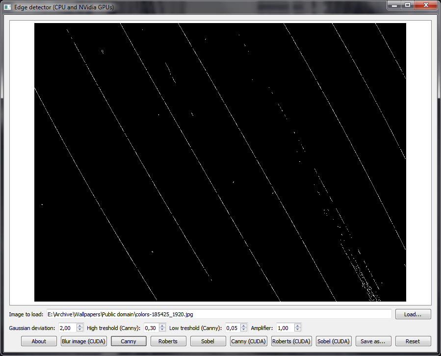
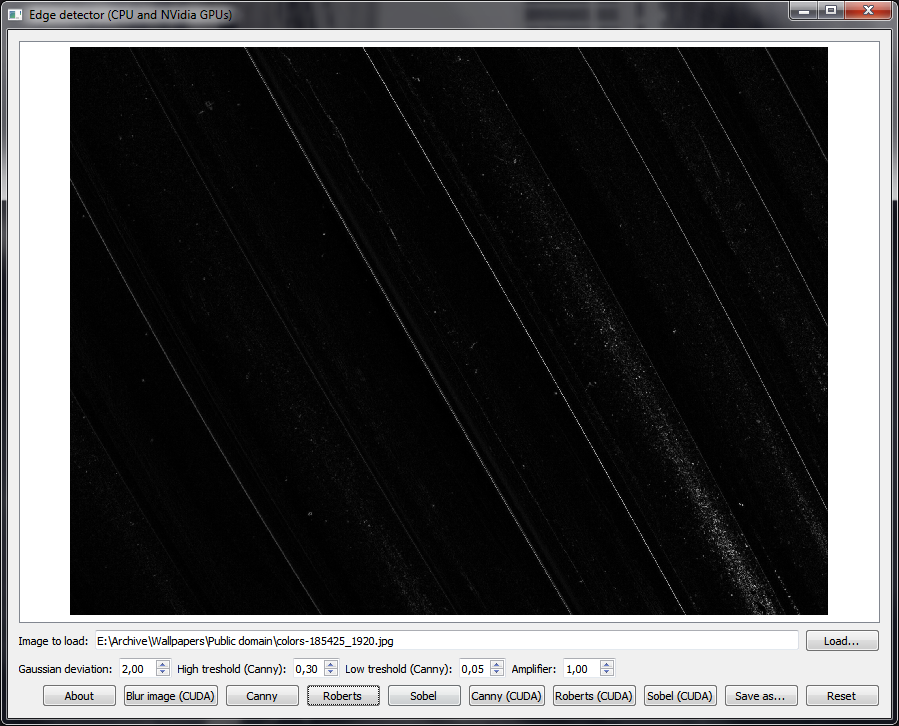
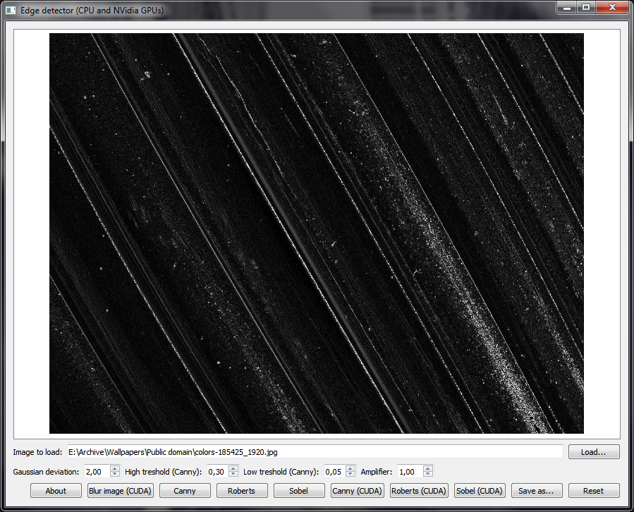

# EdgeDetectorCUDA
Demonstration of working implementations of the Canny, Sobel, and Roberts cross edge detection algorithms, each algorithm implemented in a CPU and a NVidia CUDA version. Written in Qt/C++.

## Download

Download link: [Win32 binary](https://github.com/Extender/EdgeDetectorCUDA/raw/master/bin/edgedetectorcuda-v1.0-bin-win32.zip)

## Screenshots

### Input

### Canny edge detection

### Roberts cross edge detection

### Sobel edge detection

